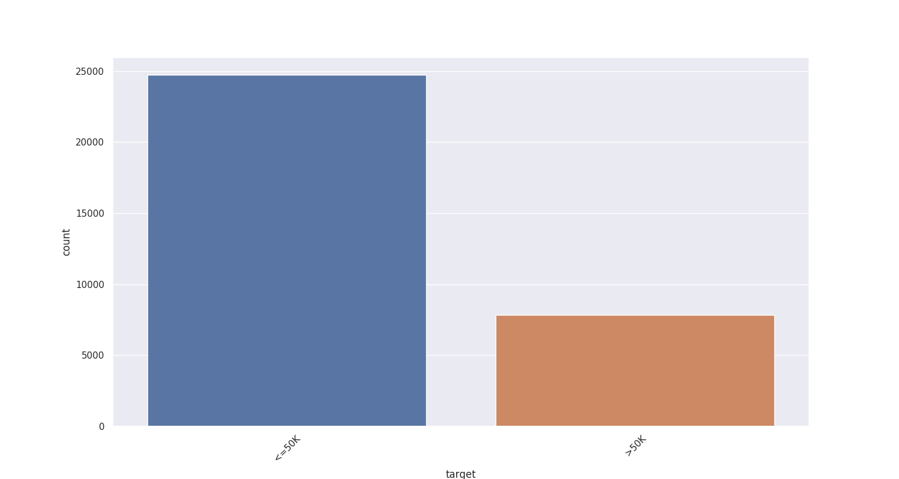
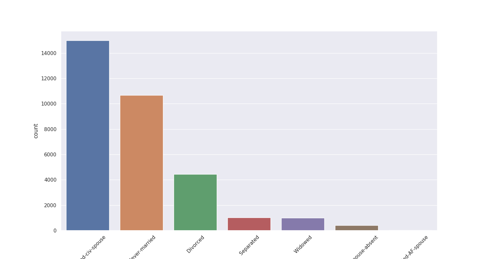
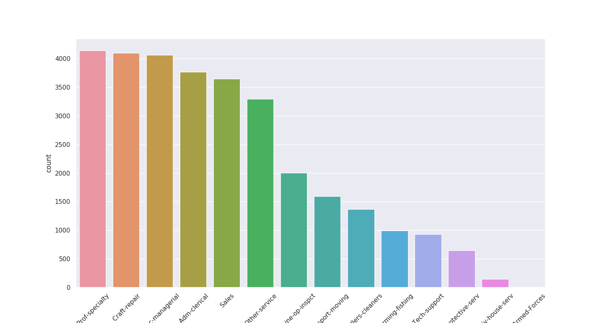

## Categorical Variables

target

This are unique values in this categorical column.  <=50K , >50K

Top values are:
*  <=50K (24720),
*  >50K (7841),

marital.status

This are unique values in this categorical column.  Married-civ-spouse , Never-married , Divorced , Separated , Widowed , Married-spouse-absent , Married-AF-spouse

Top values are:
*  Married-civ-spouse (14976),
*  Never-married (10683),
*  Divorced (4443),
*  Separated (1025),
*  Widowed (993),

occupation

This are unique values in this categorical column.  Prof-specialty , Craft-repair , Exec-managerial , Adm-clerical , Sales , Other-service , Machine-op-inspct , Transport-moving , Handlers-cleaners , Farming-fishing , Tech-support , Protective-serv , Priv-house-serv , Armed-Forces

Top values are:
*  Prof-specialty (4140),
*  Craft-repair (4099),
*  Exec-managerial (4066),
*  Adm-clerical (3770),
*  Sales (3650),

sex

This are unique values in this categorical column.  Male , Female

Top values are:
*  Male (21790),
*  Female (10771),

